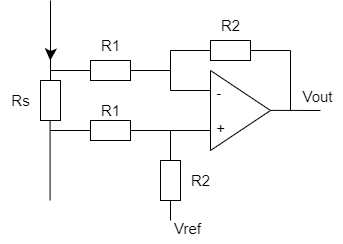

# Differential gain and offset with OP-AMP

The phase current is measured with a current shunt, but instead of measuring the voltage across the shunt to groud, we instead
measure only over the shunt. But we measure a voltage difference that will chagne in sign, and we need to scale and offset it
for the ADC (that works in the range 0.0-3.3V).

Source: https://electronics.stackexchange.com/questions/93423/how-to-amplify-and-offset-the-voltage-in-an-opamp

